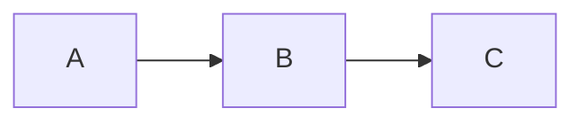

vidascontadas
=============

Un ambicioso proyecto para poner nombre y explicar la historia de "las personas fusiladas, desaparecidas y represaliadas de la Guerra Civil y el Franquismo.

El proyecto nace durante el Hackathon de las Jornadas de Periodismo de Datos celebradas en Barcelona en Mayo de 2013.

